  
  
  

---

## 🧑‍💻 About Me

I'm a **Computer Science undergrad at IIIT Vadodara** with a passion for building end-to-end digital products — from pixel-perfect UI/UX to robust backend systems. I enjoy working at the intersection of **design and engineering**, creating tools that are both functional and beautiful.

---

## 🛠️ Tech Stack

### 💬 Languages

<table align="center">
  <tr>
    <td align="center" width="90">
      
       <b>C/C++</b>
    </td>
    <td align="center" width="90">
      
       <b>JavaScript</b>
    </td>
    <td align="center" width="90">
      
       <b>TypeScript</b>
    </td>
    <td align="center" width="90">
      
       <b>Python</b>
    </td>
    <td align="center" width="90">
      
       <b>HTML</b>
    </td>
    <td align="center" width="90">
      
       <b>CSS</b>
    </td>
    <td align="center" width="90">
      
       <b>SQL</b>
    </td>
  </tr>
</table>

### 🌐 Frontend

<table align="center">
  <tr>
    <td align="center" width="90">
      
       <b>React.js</b>
    </td>
    <td align="center" width="90">
      
       <b>Tailwind</b>
    </td>
    <td align="center" width="90">
      
       <b>Three.js</b>
    </td>
    <td align="center" width="90">
      
       <b>Figma</b>
    </td>
    <td align="center" width="90">
      
       <b>Blender</b>
    </td>
  </tr>
</table>

### ⚙️ Backend

<table align="center">
  <tr>
    <td align="center" width="90">
      
       <b>Node.js</b>
    </td>
    <td align="center" width="90">
      
       <b>Express.js</b>
    </td>
    <td align="center" width="90">
      
       <b>FastAPI</b>
    </td>
    <td align="center" width="90">
      
       <b>OpenCV</b>
    </td>
  </tr>
</table>

### 🗄️ Databases & Cloud

<table align="center">
  <tr>
    <td align="center" width="90">
      
       <b>MongoDB</b>
    </td>
    <td align="center" width="90">
      
       <b>MySQL</b>
    </td>
    <td align="center" width="90">
      
       <b>PostgreSQL</b>
    </td>
    <td align="center" width="90">
      
       <b>Redis</b>
    </td>
    <td align="center" width="90">
      
       <b>Supabase</b>
    </td>
    <td align="center" width="90">
      
       <b>Vercel</b>
    </td>
  </tr>
</table>

### 🔧 Tools & DevOps

<table align="center">
  <tr>
    <td align="center" width="90">
      
       <b>Git</b>
    </td>
    <td align="center" width="90">
      
       <b>GitHub</b>
    </td>
    <td align="center" width="90">
      
       <b>Docker</b>
    </td>
    <td align="center" width="90">
      
       <b>VS Code</b>
    </td>
    <td align="center" width="90">
      
       <b>Postman</b>
    </td>
  </tr>
</table>

---

## 🚀 Featured Projects

### 🍽️ PortionUp:Automated Meal Nutrient Estimator
> Real-time multi-object food detection & nutritional analysis pipeline
- > Comprehensive food detection & portion tracking app

- Built with **YOLO + OpenCV** — achieved **88% mAP** on custom dataset
- Reduced inference latency by **35%** via image preprocessing optimization
- Mapped detected food items to calories & macronutrients with **<10% variance**

- Robust backend + interactive frontend + dedicated ML component
- [View on GitHub →](https://github.com/ojasdhargave-iiitv/portionup)

`TypeScript` `React` `Machine Learning`

`Python` `YOLO` `OpenCV` `NumPy` `FastAPI` `React Native`

---

### 🏗️ SaaS Backend Boilerplate IDE
> Integrated code editor, compiler pipeline, and modular backend template engine

- Automates production-ready boilerplate with **auth, RBAC, DB, and payments** modules
- Reduces backend setup time by **65%** vs manual initialization
- In-browser code editor with **compilation + runtime execution** support

`TypeScript` `React` `Node.js` `Express` `Docker` `PostgreSQL`

---

### 🚗 Self Driving Car
> Neural network algorithm (no lib) for autonomous traffic navigation

- Implemented entirely in **vanilla JavaScript** — no ML library dependencies
- [View on GitHub →](https://github.com/ojasdhargave-iiitv/Self_driving_Car)

`JavaScript` `Neural Networks`

---

## 📊 GitHub Stats

  
  

  

---

## 📬 Connect with Me

---

  
  ⭐️ If you like my work, consider starring a repo! | Building reliable things — always iterating.

